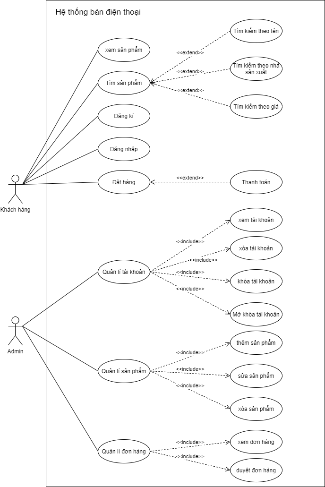
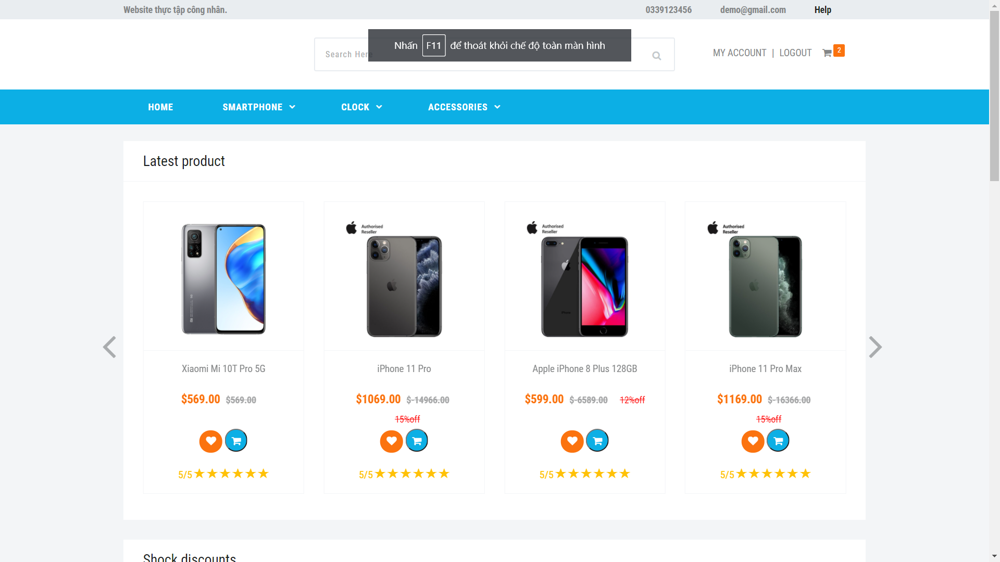
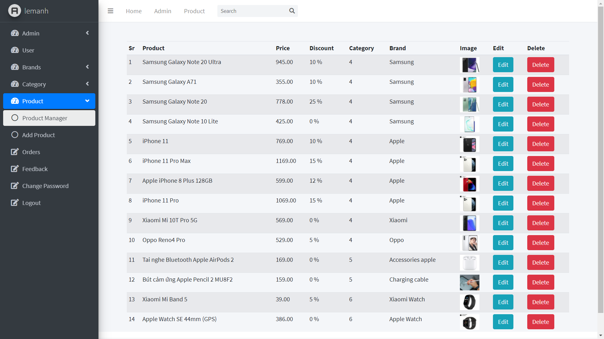

# Lập trình web bán hàng điện thoại sử dụng Flask!
Link website: 
- Giao diện người dùng: [https://thuctapcongnhan2020.herokuapp.com/](https://thuctapcongnhan2020.herokuapp.com/)
- Giao diện admin: [https://thuctapcongnhan2020.herokuapp.com/admin](https://thuctapcongnhan2020.herokuapp.com/admin)

Trên đây là source của báo cáo thực tập công nhân. Cám ơn sự đóng góp của các thành viên: [Đức Minh](https://www.facebook.com/ndminh1004/), [Long Nhật](https://www.facebook.com/hoanglongnhat0605/), [Đăng Bin](https://www.facebook.com/proxike/), [A Danh](https://www.facebook.com/profile.php?id=100001136116158).
- Tên đề tài : **Website bán hàng điện thoại.**
- Ngôn ngữ backend: [Flask-Python](https://flask.palletsprojects.com/en/1.1.x/)
- Cơ sở dữ liệu: MySQL.

- Ngày bắt dầu code: 14/10/2020
- Công bố version 1.0. : 09/11/2020 (Hoàn thành tương đối các chức năng theo sơ đồ use_case)
	- 1.0.1: 10/11/2020 (Chỉnh sửa 1 số lỗi, Thêm chức năng chat bot messenger facebook, lưu lịch sử giỏ hàng)
	- 1.1  : 30/12/2020 (Cập nhận giao diện mới cho admin)
## Mục lục:
1.[Hướng dẫn cài đặt](#p1)

2.[Các chức năng chính của chương trình](#p2)

3.[Cấu trúc thư mục chương trình](#p3)

4.[Tài liệu tham khảo](#p4)

<a id="p1"></a> 
# Hướng dẫn cài đặt:
1. Clone code từ github:

```shell
git clone https://github.com/lemanh99/WebThucTapCongNhan.git
```

2. Cài đặt python : [Python 3.8](https://www.python.org/downloads/release/python-380/)

3. Download database: [here](database/myshop.sql)

4. Cài đặt môi trường thư viện tự động sử dụng tệp requirements.txt

```shell
pip install -r requirements.txt
```

5. Khởi chạy chương trình:
```shell
python run.py
```
7. Truy cập trang admin: thêm **/admin** sau tên miền.
6. Tài khoản đăng nhập trang admin:  Tai khoan admin: [lemanh@gmail.com](lexuanmanh101199@gmail.com) ,password: manh1999

<a id="p2"></a> 
# Các chức năng chính của chương trình.
Được đặc tả qua tài liệu Usecase tổng quát:
<div align='center'>
  
</div>

- Giao diện chính:





<a id="p3"></a> 
# Cấu trúc thư mục chương trình
```
$ Cấu trúc thư mục
.
├── shop
│   ├── admin
│   └── carts
│   └── customers
│   └── products
│   └── static
│   └── template
│   └── __init__.py
├── images
│   ├── use_case.png
│   ├── GUIAdmin.png
│   ├── GUIUser.png
├── database
│   ├── myshop.sql
└── requirements.txt
└── README.md
└── run.py

```

<a id="p4"></a> 
# Tài liệu tham khảo

 1. Template : [https://easetemplate.com/downloads/online-mobile-store-shopping-website-template/](https://easetemplate.com/downloads/online-mobile-store-shopping-website-template/)
2. Youtube: [https://www.youtube.com/watch?v=o9TwipumGoU&list=PLYPlvTh05MsxJja9bzQCSTDu4hnEv5N](https://www.youtube.com/watch?v=o9TwipumGoU&list=PLYPlvTh05MsxJja9bzQCSTDu4hnEv5N_u&index=1)
